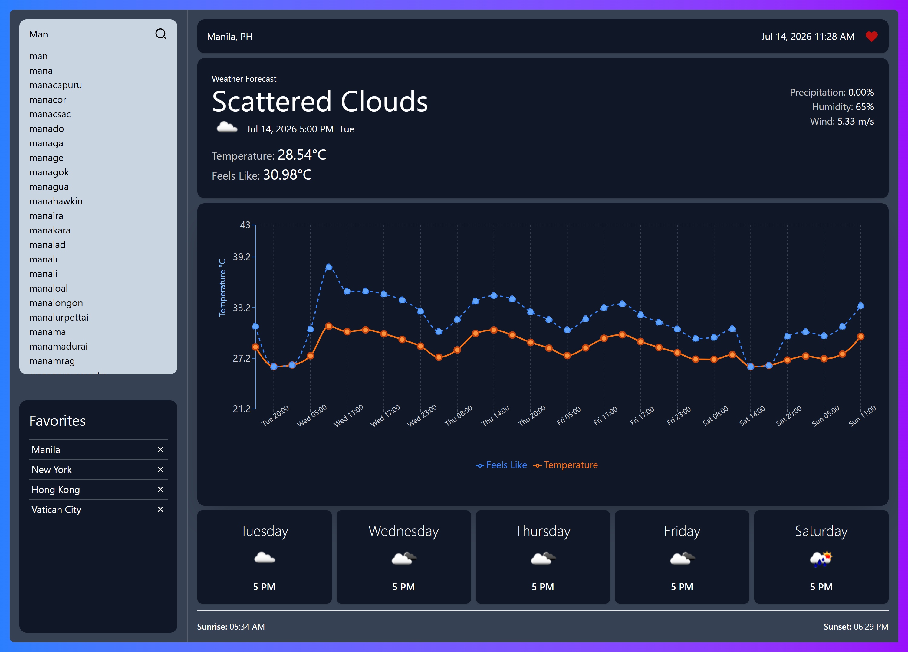

# Climate Vyi

Climate Vyi is a modern weather forecast application that allows users to view real-time weather conditions through a clean and interactive user interface.

## Features

- View current weather conditions
- Search weather by location
- Interactive weather charts
- Responsive and modern UI
- Fast and lightweight experience

## Tech Stack

### Frontend
- React.js
- Tailwind CSS
- Recharts
- Lucide React
- Zustand (Global State Management)

### Backend
- Go
- Gorilla Mux (HTTP Router)
- Joho Godotenv (Environment Variable Management)

### API
- OpenWeather API (Weather Data)

## Dependencies

| Technology | Purpose |
|------------|---------|
| React.js | Frontend Framework |
| Tailwind CSS | Styling |
| Recharts | Weather Data Visualization |
| Lucide React | Icons |
| Zustand | Global State Management |
| Go | Backend API |
| Gorilla Mux | HTTP Request Routing |
| Joho Godotenv | Load Environment Variables |
| OpenWeather API | Weather Forecast Data |

## Getting Started

### Prerequisites

- Go
- Node.js
- npm or yarn
- OpenWeather API Key

### Installation

#### Backend

```bash
cd backend
go mod tidy
go run main.go
```

#### Frontend

```bash
cd frontend
npm install
npm run dev
```

## Environment Variables

Create a `.env` file inside backend directory and add your OpenWeather API key.

```env
OPEN_WEATHER_API_KEY=your_api_key_here
```

Create another `.env` file inside frontend directory and add the backend API URL.

```env
VITE_API_URL=http://localhost:8080/api
```

Make sure it ends with api.

## Screenshots

<p align="center">
  
</p>

## License

This project is licensed under the MIT License.